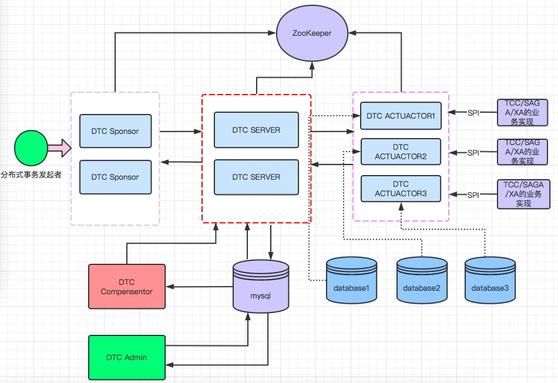
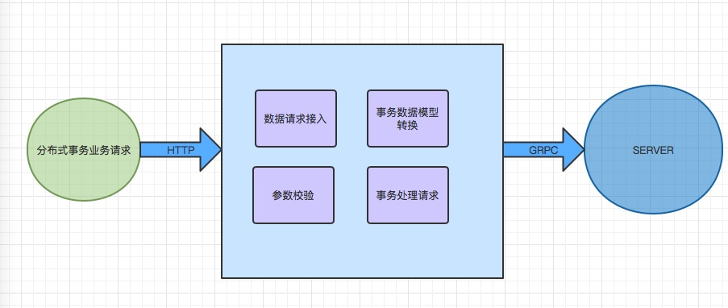
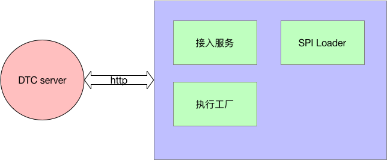
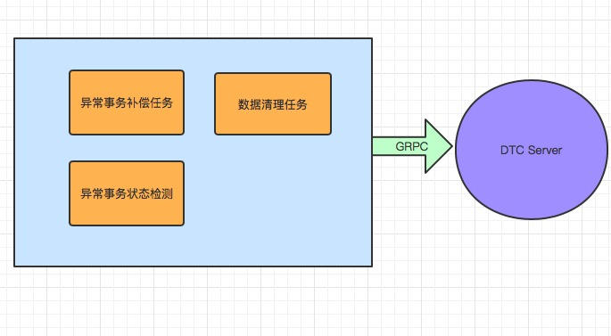
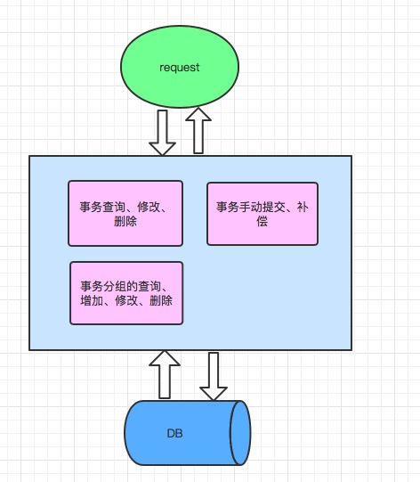
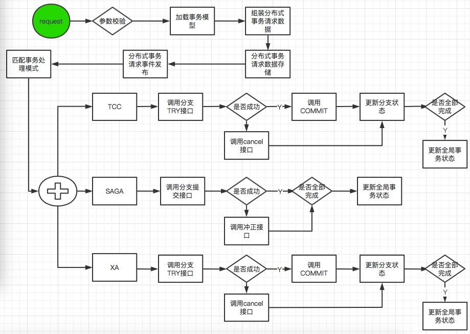
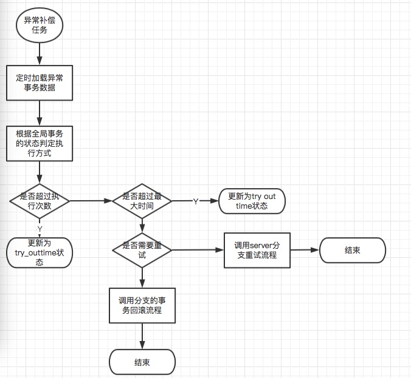

# distributed-transaction-coordinator- 分布式事务协调器(DTC)
**分布式事务协调器(distributed-transaction-coordinator简称dtc) 是一款高性能、高可用、简单易用的开源的分布式事务框架，致力于通过简单开发、简单配置、快速实现分布式事务中的数据一致性。支持多种分布式事务模式：TCC、SAGA、XA等。为用户提供一个方便易用的分布式事务开发框架**。

## TCC模式
TCC模式分为Try,Confirm,Cancel三个操作，用户需要在具体的应用中实现该三个方法。事务发起的时候第一阶段执行Try方法，第二阶段提交执行Confirm方法，回滚执行Cancel方法。
## SAGA模式
saga模式是一种冲正补偿的模式，分布式事务分为多个参与者，每个参与者都需要根据业务场景实现正向操作和冲正操作（回滚）。分布式事务执行的时候，会调用每一个参与者提供的正向操作方法，如果都执行成功，则提交事务。如果有其中一个执行失败，则会调用冲正操作，使事务进行回滚。回到原来的状态。
## XA模式
XA 规范 是 X/Open 组织定义的分布式事务处理（DTP，Distributed Transaction Processing）标准。
XA 规范 描述了全局的事务管理器与局部的资源管理器之间的接口。 XA规范 的目的是允许的多个资源（如数据库，消息队列等）在同一事务中访问，这样可以使 ACID 属性跨越应用程序而保持有效。XA模式的各个阶段：
### 执行阶段：
可回滚：业务 SQL 操作放在 XA 分支中进行，由资源对 XA 协议的支持来保证可回滚
持久化：XA 分支完成后，执行 XA prepare，同样，由资源对 XA协议的支持来保证持久化
### 完成阶段：
分支提交：执行 XA分支的 commit
分支回滚：执行 XA分支的 rollback

## DTC总体架构

总体架构图

### DTC Server
DTC Server是DTC的核心部件，DTC Server的功能是接收Sponsor的分布式事务请求，然后对请求的参数进行校验。校验通过后，将请求的数据转换为分布式的bean（全局事务bean、分支事务bean），并且保存到数据库表中。数据保存成功后根据分布式事务模型进行分支事务的调用。如果分支事务执行成功则更新分支事务的状态，如果分支事务全部成功则更新全局事务为成功状态，如果分支事务执行失败则回滚分支事务，并更新全局事务的状态。最后将执行结果返回给Sponsor。

DTSServer结构图

### DTC Sponsor
Sponsor是负责接入外部的业务请求，按照业务请求根据编排模型，将业务数据组装为事务的数据模型。通过GRPC接口发送给Server，Server处理之后将结果返回给Sponsor。Sponsor将结果返回给外部请求的服务.

DTC Sponsor架构图

### DTC Actuator
Acutator是分支事务的默认实现，如果分支业务方使用的是java语言，可以通过实现相关的接口实现业务逻辑即可。Acutator会负责和server之间的通信，事务的执行。目前Acutator支持的事务模型是TCC和XA，对saga模型，如果是java语言开发，业务方可以依托Actuator来实现。简化调用。

DTC Actuator架构图

### DTC Compensator
Compensator模块是负责补偿异常事务补偿的服务以及数据清理的工作。通过定时任务的机制查下失败的任务，根据分支任务的状态和全局任务的状态设置处理机制（冲正/重试）。Compensator不负责具体的事务处理，而是将异常的任务发送给Server,由server负责具体的异常事务的处理。Compensator也会定时对数据表进行清理，保证数据表不至于过大导致性能严重下降。

DTC Compensator架构图

### DTC Admin
admin模块是管理模块，负责事务数据的增、删、改、查，手动执行事务的重试/冲正。

DTC Admin架构图

## DTC 流程说明
### DTC 总体流程

DTC流程图

总体流程说明：
1、外部服务发起分布式事务的业务流程请求给sponsor；
2、sponsor校验请求数据，如果数据不合法则返回错误；
3、sponsor根据请求的业务码加载对应的事务编排模型，按照编排模型组装事务的请求数据；
4、将事务的请求数据发送给server；
5、server接收到事务请求数据，转换为数据库的bean，保存到数据库中；
6、将事务请求发送到内存队列；
7、事务处理器订购事务请求事件，按照事务的模型匹配处理流程
8、如果是TCC则按照TCC的流程进行处理，调用分支事务执行TRY接口，如果成功则执行Commit，如果失败则执行Cancel接口
9、如果是SAGA则调用SAGA分支的commit接口，如果失败则执行冲正接口；
10、如果是XA则Xa的prepare接口，成功则执行commit，失败则执行cancel；
11、如果全部都执行成功则更新全局事务的状态为成功
12、如果执行失败则根据回滚的结果更新为回滚成功或者失败的状态。
13、将执行结果返回给sponsor
14、sponsor将结果返回给外部服务。

### DTC Compensator的异步补偿流程

DTC异步补偿流程

1、Compensator模块中的定时补偿任务，根据全局事务的状态(init,tryFailed,commitFailed,cancelFailed)加载对应的异常事务。
2、检测异常事务的执行次数，如果次数超过最大的执行次数，则更新全局事务的状态为tryTimeout.
3、检测异常事务是否超过最大的执行时间，如果超过则更新为tryTimeout。
4、如果执行的时间没有超过最大时间，也没有超过最大次数则判断事物的分支是否需要重试，如果重试则调用相关的重试接口
5、如果不需要重试或者超过最大重试次数则调用server的事物冲正接口。