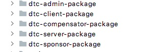

# DTC使用说明
## 模块说明
### sc-transaction-common
该模块是通用的一些bean和常量。被各个模块所引用。
### sc-transaction-core
该模块是server，actuator，sponsor等模块的一些公共实现和基本逻辑。
### sc-transaction-rpc
该模块是grpc的接口，server和actuator和sponsor之间的交互都是通过该模块定义的接口实现。
### sc-transaction-server
该模块是核心的模块，实现了分布式事务的主要的逻辑。分布式事务的发起和状态的处理。
### sc-transaction-sponsor
该模块是负责接入外部的分布式事务的请求，并对相关的数据进行校验。根据外部请求加载对应的数据模型并调用server的接口处理分布式事务
### sc-transaction-mybatis
该模块是对于数据库的相关的操作。
### sc-transcation-acutator
该模块是分布式事务分支的实现框架，可以帮助实现tcc/xa和saga的事务分支，使用该模块可以省去接口调用，状态管理。但是只限于java开发的分支事务。
### sc-transaction-compensator
该模块是对与执行异常的分布式事务进行重试或者补偿的操作。
### sc-transaction-admin
该模块是负责分布式事务的查询以及对于执行出错的分支事务进行手工冲正或者重试。
### deploy
改模块负责整体项目的编译，部署的相关脚本和配置文件。
## 数据表说明
tb_trans_info 全局事务的表
tb_branch_info 分支事务表
tb_trans_group 事务分组表
tb_trans_model 事务模型表
tb_trans_model_detail 事务模型详细信息表
tb_error_info 事务执行出错的记录表

## 接口说明
TCC事务/XA事务请求:

{

     "appName": "sponsor", //发起者服务的名字，必填
	"transGroupId": "101", //分组的id
	"businessId": "253295889696022528", //业务请求的id，必须唯一
	"timeout": 100000, //超时时间，不填则用默认超时时间
	"transMode": "TCC",//事务模式TCC/SAGA/XA
	"transCode": "A0101",//业务编码，必填，根据业务编号查询事务编排模型
	"timeoutType": "CANCEL", //事务超时处理策略CANCEL/ALARM
	"callInParallel": false,//是否并行，非顺序
	"retryCount": 0, //重试次数
	"branchTransRequests": [{ //分支请求
		"branchTransName": "ta1", //分支编排的名字，必填，通过该名字查询编排表中的分支事务信息
		"branchName": "ta1", //分支名字
		"transactionName": "transactionA", //分支事务的名字，分支服务提供
		"branchParamMap": { //分支参数
			"addMoney": "1000"
		},
		"hasParent": false, //是否有父节点
		"timeout": 100000, //分支超时时间
		"timeOutType": "CANCEL", //事务超时处理策略CANCEL/ALARM
		"retryRequired": false, //是否需要重试
		"retryCount": 0 //重试次数
	}, {
		"branchTransName": "ta2", //分支编排的名字，必填，通过该名字查询编排表中
		"branchName": "ta1",  //分支名字
		"transactionName": "transactionB", //分支事务的名字，分支服务提供
		"branchParamMap": { //分支参数
			"reduceMoney": "1000"
		},
		"hasParent": false,  //是否有父节点
		"timeout": 100000, //分支超时时间
		"timeOutType": "CANCEL", //事务超时处理策略CANCEL/ALARM
		"retryRequired": false,  //是否需要重试
		"retryCount": 0  //重试次数
	}]
}

SAGA类型事务请求:    
{
	
	"appName": "sponsor",  //发起者服务的名字，必填
	"businessId": "253296938251051008", //业务请求的id，必须唯一
	"transCode": "A0001", //业务编码，必填，根据业务编号查询事务编排模型
	"branchTransRequests": [{
		"modelBranchName": "ta2", //分支编排的名字，必填，通过该名字查询编排表中的分支事务信息
		"branchParamMap": { //请求参数
			"reduceMoney": "1000"
		}
	}, {
		"modelBranchName": "ta1", //分支编排的名字，必填，通过该名字查询编排表中的分支事务信息
		"branchParamMap": { //请求参数
			"addMoney": "1000",
			"paramA": "ss"
		}
	}]
	
}

## 编译部署说明

1.进入distributed-transaction-coordinator下执行mvn clean package, 然后进入的deploy目录：执行buildsh下的build相关的脚本，编译出各个模块的部署包编译完成后，在deploy目录下会出现编译的结果，以dtc-开头的相关目录。
   
   
2.执行sc-transaction-mybatis的resources/sql文件夹下面的mysql.sql所有的建表语句

3.配置需要部署模块下面的resrouces下的相关配置文件:
application.properties包含服务端口、线程池、数据库相关的配置
registry.propertes 包含zk的注册信息

4.部署并启动zookeeper。

5.启动dtc-transaction-server，启动脚本在dtc-transaction-server/scripts下的startServer.sh

6.启动dtc-transaction-sponsor。启动脚本在dtc-transaction-sponsor/scripts下的startServer.sh

7.启动dtc-transaction-actuator。启动脚本在dtc-transaction-actuator/scripts下的startServer.sh

8.启动dtc-transaction-compensator。启动脚本在dtc-transaction-compensator/scripts下的startServer.sh

### 使用sc-transaction-actuator快速开发分支业务
1. 在工程中引入sc-transaction-actuator.jar,sc-transaction-common.jar,sc-transaction-core.jar包，然后实现相关接口:

> public interface TccClientExecutor extends TransHandlerSPI {
> 
>       ScResponseMessage prepare(ScRequestMessage scRequestMessage) throws ScClientException;
> 
>       ScResponseMessage confirm(ScRequestMessage scRequestMessage) throws ScClientException;
> 
>       ScResponseMessage cancel(ScRequestMessage scRequestMessage) throws ScClientException;
> }
> 
> public interface XaClientExecutor extends TransHandlerSPI {

>     ScResponseMessage prepare(ScRequestMessage branchPrepareRequest) throws ScClientException;
> 
>     ScResponseMessage confirm(ScRequestMessage branchCommitRequest) throws ScClientException;
> 
>     ScResponseMessage cancel(ScRequestMessage branchRollbackRequest) throws ScClientException;
> }

实现完成后，打成jar包，放到dtc-transaction-actuator下的extlib目录下。重启dtc-transaction-actuator.
